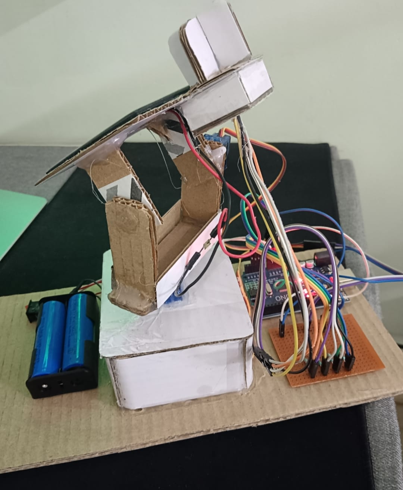
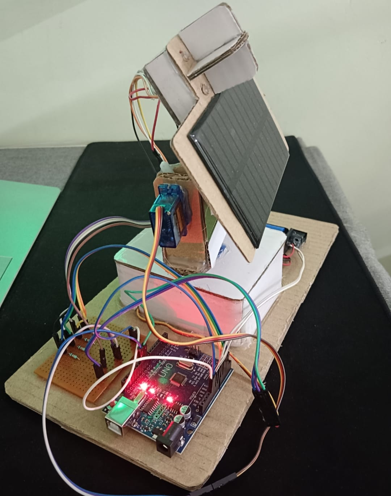
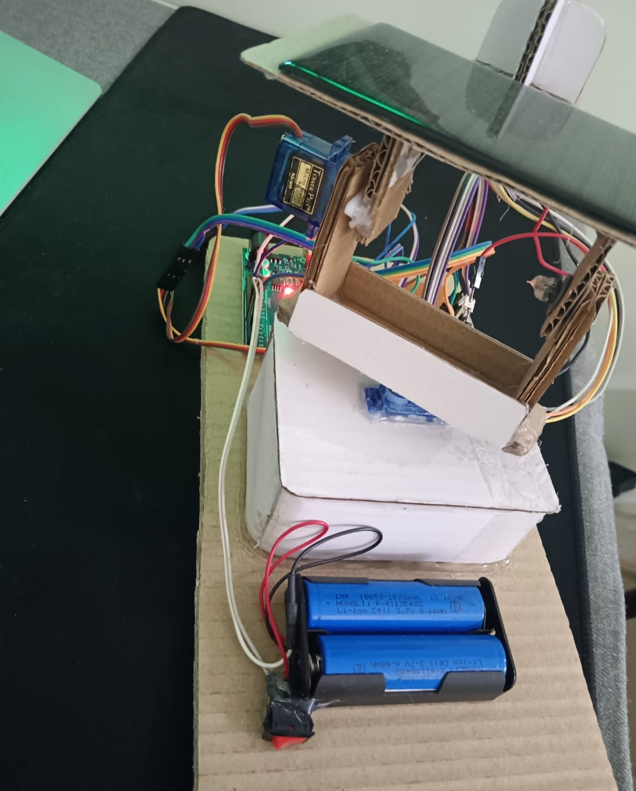

# Dual Axis Solar Tracker System

## Introduction
This project is an Arduino-based Dual Axis Solar Tracker System. It uses LDR sensors to detect sunlight intensity and SG90 servo motors to rotate the solar panel toward the direction of maximum light.

## Components Used
- Arduino Uno
- LDR Sensors
- SG90 Servo Motors
- Solar Panel
- Resistors
- Lithium Battery
- Connecting Wires
- Switch

## Working Principle
The LDR sensors sense sunlight from different directions. Arduino compares the sensor values and controls the servo motors. The servo motors move the solar panel horizontally and vertically so that it faces the maximum sunlight.

## Features
- Automatic sunlight tracking
- Dual-axis movement
- Low-cost embedded system
- Improves solar panel alignment
- Useful for renewable energy applications

## Applications
- Solar energy systems
- Smart renewable energy projects
- Engineering mini projects
- Embedded system learning

## Future Improvements
- IoT-based monitoring
- Battery charging status display
- Weather protection system
- Mobile app control

## Project Status
Completed
## Project Images
### Front View
.jpg)

### Side View

### Wiring

### Final Project

